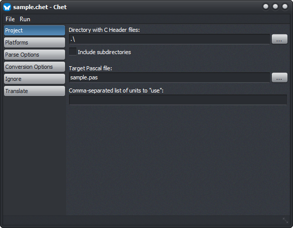

# Chet - C Header Translator for Delphi

Chet is a `.h-to-.pas` translator powered by [libclang for Delphi](https://github.com/neslib/Neslib.Clang).

## Features

Unlike some other header translators, Chet uses the Clang compiler to parse header files, resulting in more accurate translations that require fewer manual adjustments.

Some notable features are:

* Translates C data types such as structs, union, enums, typedefs, procedural types and opaque types.
* Translates C functions to Delphi procedures or functions.
* Tries to translate `#define` declarations to constants where possible.
* Generates a single `.pas` file for an entire directory of `.h` files. This reduces issues due to dependencies between header files.
* Generates output for multiple platforms (Winsows, macOS, Linux, iOS and Android) if desired.
* You can customize the Clang parsing process by supplying command line arguments to the compiler.
* You can customize the output of some conversion operations.
* Retains any Doxygen style documentation comments if desired, or converts them to XmlDoc comments or PasDoc comments.
* Provides a GUI for configuring the conversion process, and allows you to save the conversion settings to a `.chet` project file for reuse.

## Limitations

* Chet only works with C header files, *not* with C++ header files.
* All non-inlined functions in the header files are translated and assumed to be available in the static or dynamic library for the project. This does not have to be the case. (Inlined functions are never translated since they are never available in the library.)
* Since Clang is used to parse the header files, this means that Clangs preprocessor is run as well to perform conditional parsing (guided by `#ifdef` directives). This is both good and bad. It is good because it improves conversion accuracy. But it can be bad because it uses the system that Chet runs on to determine some conditional paths. For example, because Chet runs on Windows, it will parse code in `#ifdef _WIN32` sections but skip any code in sections for other platforms.

## Requirements

Since Chet uses an actual compiler, you will need to have a (minimal) C develop environment installed, as well as LLVM with Clang. Clang needs to be able to find the system headers for the development environment. These will usually be available if you have some version of Visual Studio with Visual C++ installed. The free (community) edition of Visual Studio suffices.

You can run Chet first to check for any errors related to missing dependencies. If you get any dependency errors when running the translator, then you can download the dependencies here:

* [LLVM with Clang](http://releases.llvm.org/download.html) (Clang for Windows (64-bit) is recommended).
* [Visual Studio IDE](https://www.visualstudio.com/vs/) (the free Community edition suffices; be sure to install C++ support).

You can use the pre-compiled 64-bit Windows Chet application in the `Bin` directory.

If you want to compile Chet yourself, then you also need [libclang for Delphi](https://github.com/neslib/Neslib.Clang) and make sure the Delphi IDE can find it (the Chet project will find it automatically if the `Neslib.Clang` directory is at the same level as the `Chet` directory).

## Contributions

Thank you for these contributions:

* [Michał Sznajder](https://github.com/michalsznajder) for improved Char conversions.
* [Chiptamer](https://github.com/chiptamer) for adding support for typed const declarations.
* [Jarrod Davis](https://github.com/jarroddavis68) for adding post-processing support.
* [Alexey.t](https://github.com/alexeydott) for adding support for packed bit fields in C structs, user-defined type mappings, and the ability to ignore certain header files.

## User Guide

Chet is pretty straightforward. In many cases, you only need to provide a directory with header files, the name of the output `.pas` file and select "Run Header Translator (F9)".

For more control over the conversion process, you can specify various options, described below.

### Menu

Any configuration options you set can be saved to a `.chet` configuration file (which is a simple ini-file). This allows you to load the settings later to rerun the conversion (for example, when new versions of the header files have been released). You can load and save these configuration options using the `File` menu.

To help pre-configure some settings for a new session, select `File | New Project... (Ctrl+N)`. You enter the name of the project and Chet will pre-configure some settings based on the name you enter (although you can always modify those settings later).

The `Run` menu just as the single option `Run Header Translator`, which you can also activate with `F9`.

### Project Page

The project page contains the most important configuration options:

* **Directory with C Header files**: specify the directory with the source `.h` files here. The directory may be relative to the directory containing the `.chet` project file. Click the `...` button to browse for a directory. It is recommended that you don't use the directory with the original C source code. Instead, copy the header files to a separate directory just for conversion purposes. This makes it easier to delete header files you don't want to convert, or to make edits to header files for conversion purposes.
* **Include subdirectories**: check this box if the header files are spread across multiple directories. In that case, Chet will search all subdirectories of the given directory as well.
* **Target Pascal file**: specify the name of the `.pas` file that will be generated. I single combined Pascal file will be generated for all parsed header files. The name may be relative to the directory containing the `.chet` project file. Click the `...` button to open a save dialog.
* **Comma-separated list of unit to "use"**: if the header files depend on declarations in some other Delphi units (such as `Windows.Winapi`), then you can list those units here. The will be added to the uses clause of the generated Pascal file.

### Platforms Page

On this page you specify what platforms you want to target, and how you want to configure them.

* **Library constant**: specify the name of the constant to use for the library name. For example, if you have a library called "mylib.dll", then the name of this constant could be `LIB_MYLIB`, so the following declaration will be generated: `const LIB_MYLIB = 'mylib.dll'`.

Next are checkboxes for all platforms you want to target (32-bit Windows, 64-bit Windows, 32-bit macOS, 64-bit Linux, iOS and Android). For each platform that you check, you must enter the following options:

* **Library name**: the name of the dynamic or static library for the platform**.**
* **Prefix (_PU)**: the function name prefix to use for the platform. This can usually be left empty. But, depending on how the library is built, all function names may be prefixed (usually with an underscore `_` character).

### Parse Options Page

Here you can customize the Clang parsing process.

* **Ignore parse errors**: check this box to ignore any parsing errors and try to translate the header files anyway. Note that this can lead to incorrect output, so you generally should leave this options unchecked. You may find this option useful as a temporary option to check for parsing errors. Normally, Clang will stop parsing after it encounters the first fatal error. By checking this box, it will show all parsing errors (up to a limit), so you can address those and then uncheck this box again.
* **Command line arguments to pass to Clang**: specify any command line arguments to pass to the Clang compiler here. There is usually no need for this, but some C projects may require some command line arguments for parsing to succeed. The most common command line arguments you may need are adding preprocessor defines (`-D<define>`) and include search paths (`-I<path>`). There are separate buttons to make it easier to add these. Refer to the Clang documentation for information about available command line arguments.

### Conversion Options

This is where you customize the generated output.

* **Calling convention**: specify the calling convention to use for all translated functions. You can choose between `cdecl` and `stdcall`. In almost all cases, you should use the default `cdecl` calling convention. Use `stdcall` only for 32-bit Windows DLL's which you know are compiled with the stdcall calling convention. Those are usually only Windows system DLL's. Most 3rd party DLL's use cdecl.
* **Comment handling**: here you specify how to handle documentation comments (see also remarks below):
  * *Keep comments as-is* (default): do not convert the comments, but keep them in their original (Doxygen) style.
  * *Remove comments*: all comments will be removed.
  * *Convert comments to XmlDoc style (experimental)*: converts Doxygen-style comments to XmlDoc style comments (the default documentation style for Delphi). This feature is still under construction and considered experimental.
  * *Convert comments to PasDoc style (experimental)*: converts Doxygen-style comments to [PasDoc](https://github.com/pasdoc/pasdoc) style comments. This feature is still under construction and considered experimental.
* **Convert "char" to**: the C `char` type is ambiguous, it can be used as an 8-bit integer or a character in a text string. The typed versions `signed char` and `unsigned char` are always converted to `Shortint` and `Byte` respectively. But when no signed-ness is specified, you have the following options:
  * *UTF8Char* (default): convert `char` to a cross-platform `UTF8Char`.
  * *Shortint*: convert `char` to an 8-bit signed `Shortint`.
  * *Byte*: convert `char` to an 8-bit unsigned `Byte`.
* **Reserved word handling**: header files may use identifiers which conflict with reserved words in Delphi (such as `begin` and `procedure`). Here you specify how you want to convert these identifiers:
  * *Add leading '&'* (default): prefix the identifier with an ampersand.
  * *Add leading '_'*: prefix the identifier with an underscore.
  * *Add trailing '_'*: add an underscore to the end of the identifier.
* **Treat directives as reserved words**: whether to treat Delphi directives as reserved words as well (checked by default). Technically, you are allowed to use many directives (such as `public`) as identifiers in Delphi, but it looks strange and Delphi's syntax highlighter treats them differently. So you usually want to treat these as reserved words as well.
* **Enum handling**: you have the option of converting C enums in two ways:
  * *Convert to enumerated type* (default): convert to a Delphi enumerated type.
  * *Convert to integer type and constants*: convert the type name itself to an integer (as in `type MyEnum = Integer;`) and create constants for each option in the enumeration. This may be more applicable for some libraries.
* **Unconvertible declarations**: despite best efforts, Chet may not be able to convert all declarations (especially `#define`'s, see remarks below). Here you specify how to handle these:
  * *Write TODO item* (default): writes a `TODO` comment to the Delphi source code, as well as a commented-out version of the original declaration. Remember that you can view a list of all TODO's in the Delphi IDE by selecting `View | Tool Windows | To-Do List`.
  * *Comment out original declaration*: writes a commented-out version of the original declaration to the Delphi source code.
  * *Ignore declaration*: ignores the declaration and doesn't write anything to the Delphi source code.

Note that only Doxygen style documentation comments are parsed by Clang. These are comments that follow any of these format conventions:

* `/// Comment (with 3 slashes)`
* `/** Comment (with two stars) */`
* `/*! Comment (with exclamation point) */`
* `///< Comment (applies to preceding declaration)`
* `/**< Comment (applies to preceding declaration) */`
* `/*!< Comment (applies to preceding declaration) */`

Chet tries to convert `#define` declarations to constants if possible. This only works if:

* The define is not function-like. That is, macros like `#define ABS(x) (x < 0) ? -x : x` cannot be translated.
* The define uses an expression that only uses other defines and literals. For example: `#define FOO 3<<BAR` will be converted to `const FOO = 3 shl BAR`.

### Ignore Page

Here you can specify a list of symbols to ignore. These symbols will not be translated.

The most common use is to ignore `#define`'s that generate conversion errors, or functions you don't need. You can also choose to ignore some types, but that may result in compilation errors later because expected types are missing.

Note that symbols are case-sensitive.

### Translate Page

The final page just has a single button "Run Header Translator" (which you can also activate with `F9`). It shows the progress of the translation process, as well as any errors that occurred while parsing the header files.

You can use these errors to fix the header files, add missing header files, or configure that parsing process by adding command line arguments (for example, by adding include search paths).

## License

Chet is licensed under the Simplified BSD License. See License.txt for details.

